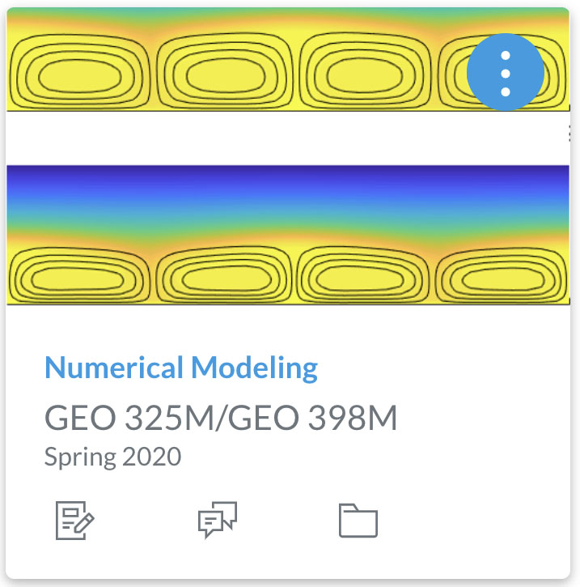
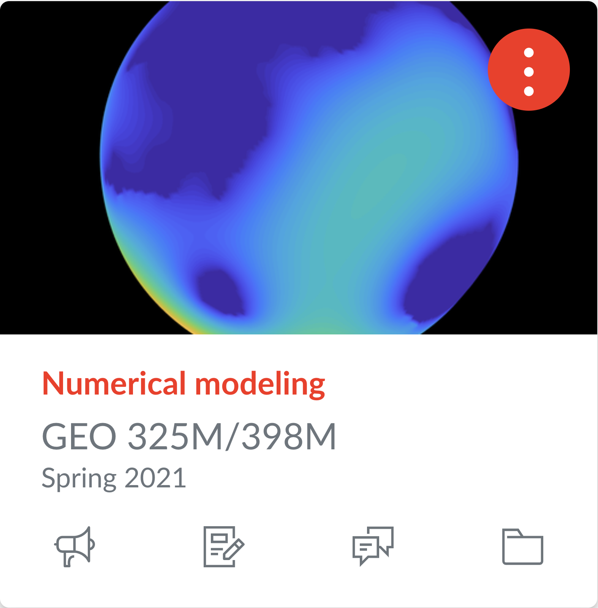

## Course Description

Covers numerical solution of dynamical problems arising in the solid earth geosciences. Entails development of individual codes in Matlab and application of codes to understanding heat transfer, wave propagation, elastic, and viscous deformations. Requires familiarity with Matlab. 

### Previous course projects:
      

The course content will be guided by a current research problem that typically leads to a scientific publication within the following year. In past classes we have worked on the following problems:

* [Spring 2018](Spring2018.md): Impact-induced cryovolcanism in Occator Crater on dwarf planet Ceres [[paper 1]](https://doi.org/10.1029/2018GL080327) [[paper 2]](https://www.nature.com/articles/s41550-020-1168-2)

* [Spring 2019](Spring2019.md): Transport of surface oxidants through Europa's ice shell [[paper 1]](https://agupubs.onlinelibrary.wiley.com/doi/abs/10.1029/2021GL095416)

* [Spring 2020](Spring2020.md): Convective upwelling in Europa's ice shell [[paper 1]](https://doi.org/10.1016/j.epsl.2021.116886) [[paper 2]](https://www.sciencedirect.com/science/article/pii/S2352340921003632?via%3Dihub)

* [Spring 2021](Spring2021.md): Mars groundwater response to impact cratering [paper submitted]

* [Spring 2022](Spring2022.md): Two-phase convection in Europa's ice shell [paper in works]

* Spring 2023: Hydrothermal convection in porous media 

### Office hours
* Monday 10-11am (in person JGB 4.216G) 
* Wednesday 3-4pm [Zoom ID 983 3529 1432](https://utexas.zoom.us/j/98335291432?pwd=aUlMUXl5S3BvRFBDc2ZkWTFkSDZrdz09) (password in email or on [Canvas](https://utexas.instructure.com/courses/1353668))

### Additional course websites:
* [Piazza](https://piazza.com/utexas/spring2023/geo325m398m/home) - Discussion board
* [Matlab Grader](https://grader.mathworks.com/courses/96667-geo-325m-398m-numerical-modeling-2023) - Homework (need accept email!)
* [Zoom ID 983 3529 1432](https://utexas.zoom.us/j/98335291432?pwd=aUlMUXl5S3BvRFBDc2ZkWTFkSDZrdz09) - Class (password in email or on [Canvas]( https://utexas.instructure.com/courses/1353668)

### Matlab basics:
Here are some LiveScripts I prepared for the first class in 2018 that didn't have a Matlab prerequisite. If you don’t have much Matlab experience, please look through them. Vectorized programming is a particularly important topic.
1. [demo_arrays.mlx](matlab/demo_arrays.mlx) [[pdf]](matlab/demo_arrays.pdf)
2. [demo_functions.mlx](matlab/demo_functions.mlx) [[pdf]](matlab/demo_functions.pdf)
3. [demo_control_flow.mlx](matlab/demo_control_flow.mlx) [[pdf]](matlab/demo_control_flow.pdf)
4. [demo_matlab_functions.mlx](matlab/demo_matlab_functions.mlx) [[pdf]](matlab/demo_matlab_functions.pdf)
5. [demo_plotting.mlx](matlab/demo_plotting.mlx) [[pdf]](matlab/demo_plotting.pdf)
6. [demo_vectorized_programing.mlx](matlab/demo_vectorized_programing.mlx) [[pdf]](matlab/demo_vectorized_programing.pdf)
7. [demo_odds_ends.mlx](matlab/demo_odds_ends.mlx) [[pdf]](matlab/demo_odds_ends.pdf) (structures, logical indexing, anonymous functions)

Below are two files that I have sometimes used for the demos in class. If you put them into the folder with class files you should have no problem.
* [marc_colors.m](matlab/marc_colors.m)
* [set_demo_defaults.m](matlab/set_demo_defaults.m)

## This years course project
In spring 2023 we will develop a model for hydrothermal convection in porous media. This has applications to several research problems, including the post impact hydrothermal evolution of the Chicxulub crater and the minig of elements from the silicate interior of asteroisd and moons, in particular Jupiter's moon Europa. 

## Introduction
### Lecture 1 (Jan 10): Course Project and Conservation Laws
* Lecture: [[pdf]](spring2023/GEO325M_2022_Lecture1.pdf) [[rec]](https://utexas.zoom.us/rec/share/YtfWlg57HiOYaI33vzqF-i5ET3xT3L9ReEop6C4uH9QvfuweQEqjf2hBdxkS_g9K.N4iMUfaxs7vsodwz)
* Notes: [Introduction to porous media](modules/PorousMediaIntro.pdf)

### Lecture 2 (Jan 12): Balance laws
* Lecture: [[pdf]](spring2023/GEO325M_2022_Lecture2.pdf) [[rec]](https://utexas.zoom.us/rec/share/joomKPCOmEvJoUM-nfEERK_POOcaaiecZ0tketKMX8UGGqWy-EoQcaSSCRBIVd8X.FyrjTIjPeCjv4LAC)
* Notes: [Balance Laws](spring2023/BalanceLaws.pdf), [Fluid Mass Blance](spring2023/FluidMassBalance.pdf), [Incompressible Flow](spring2023/IncompressibleFlow.pdf)

### Lecture 3 (Jan 17): Introduction to numerics
* Lecture: [[pdf]](spring2023/GEO325M_2022_Lecture3.pdf) [[rec]](https://utexas.zoom.us/rec/share/3L5OD3q9vDd_j4URBwYTVefKDGyKt5D2sy0vwKRODE5UBMT_ubCkRqbpoizm1cc2.d-1jpQ0_KVSvBY7i)
* Notes: [Intro to Finite Differences](), [Flow around well]()
* LiveScripts: Finite Differences [[script]](spring2023/demo_intro_numerics.mlx) [[pdf]](spring2023/demo_intro_numerics.pdf), Well Example [[script]](spring2023/demo_injection_well.mlx), [[pdf]](spring2023/demo_injection_well.pdf)

## 1D Numerics - Poisson Equation
### Lecture 4 (Jan 19): Discrete Operators
 * Lecture: [[pdf]](spring2023/GEO325M_2022_Lecture4.pdf) [[rec]](https://utexas.zoom.us/rec/share/vZmWtSkvXJuvMSqO1oaszNPOe9W5S7x0XdGwd3z3ByeBYsV5U352_KAHV5wMIfbd.eeATINkXZknzEi71) 
 * Notes: [Discrete operators in 1D](spring2023/DiscreteOps1D_2023.pdf)
 * Live Scripts: Discrete operators 1D [[script]](spring2023/demo_testing_ops.mlx) [[pdf]](spring2023/demo_testing_ops.pdf)

### Lecture 5 (Jan 24): Shallow Aquifer Model
* Lecture: [[pdf]](spring2023/GEO325M_2022_Lecture5.pdf) [[rec]](https://utexas.zoom.us/rec/share/Sf8Ii7qx2Cu23Q97jJio9KxokWXC2bS3be6PX8ZgKEEWozc7HDuRQlD0L3X6h74g.y7M0rkd3krs1vg6v)
* Notes: [Shallow Aquifer Model](spring2023/ShallowAquiferModel_2023.pdf)
* Live Scripts: Danube Tisza Example [[script]](spring2023/DanubeTiszaInterfluve.mlx) [[pdf]](spring2023/DanubeTiszaInterfluve.pdf)

### Lecture 6 (Jan 26): Dirichlet Boundary Conditions
* Lecture: [[pdf]](spring2023/GEO325M_2022_Lecture6.pdf) [[rec]](https://utexas.zoom.us/rec/share/1rOfSxe7-_496F_yjtH_ARcJiqtCqWs3-mKb6WwbDG9TGBIhTYB1krBciEH1epOW.R4uOFSjZ5ERCmtFs)
* Notes: Dirichlet BC: [homogeneous](spring2023/BC_Dirichlet_homo.pdf), [heterogeneous](spring2023/BC_Dirichlet_hetero.pdf)

### Lecture 7 (Jan 31): Effective conductivity of layered media
* Lecture: [[pdf]](spring2023/GEO325M_2022_Lecture7.pdf) [[rec]](https://utexas.zoom.us/rec/share/De7-9n_KEkX_jTvyQaUz5Cs6RoyBkyeWbmM845U7jqdqaHuME32PgqlcTMLRq2w.kdf1oNBhWrXWjFlL)
* Notes: [Layered Media](spring2023/LayeredMedia.pdf)
* Live Scripts: Effective K [[script]](spring2023/demo_layered_media.mlx) [[pdf]](spring2023/demo_layered_media.pdf)

### Lecture 8 (Feb 2): Discretizing heterogenous coefficients
* Lecture: [[pdf]](spring2023/GEO325M_2022_Lecture8.pdf)  [[rec]](https://utexas.zoom.us/rec/share/ofZ9nvM9nGunRfP48tzLQJEbDLHFNtBgVp0Ih6-kxE_zBsNGoBWCgYaOEfclo2he.mLsbNh3CGEOwLpSK)
* Notes: [Variable coefficients](spring2023/Variable_coefficients_2022.pdf)
* Live Scripts: Variable Coefficients [[script]](spring2023/demo_heterogeneous_coefficients.mlx) [[pdf]](spring2023/demo_heterogeneous_coefficients.pdf)

### Lecture 9 (Feb 7): Fluxes and Flux Boundary condition
* Lecture: [[pdf]](spring2023/GEO325M_2022_Lecture9.pdf) [[rec]](https://utexas.zoom.us/rec/share/ZDDED3RAEkDL1a717iqH8jJNgPuezLcFxpQGEpRauxP9LaUniLF0SSlEUKm-hoTJ.IUVpJI5gf28-GCol)
* Notes: [Neumann BC's](spring2023/BC_Neumann2022.pdf), [Flux reconstruction](spring2023/ComputeFluxes2022.pdf)
* Live Scripts: Neuman BC's [[script]](spring2023/demo_NeumannBCs.mlx) [[pdf]](spring2023/demo_NeumannBCs.pdf), Fluxes [[script]](spring2023/demo_comp_flux_res.mlx) [[pdf]](spring2023/demo_comp_flux_res.pdf)

### Lecture 10 (Feb 14): Radial coordinate systems
* Lecture: [[pdf]](spring2023/GEO325M_2022_Lecture10.pdf) [[rec]](https://utexas.zoom.us/rec/share/JYBvq3Jk9qRjWWH0rJdhrP5WZ3GcMpmN7q-JuxarWvXPSUpxrONbpBi50e_CG-ne.MYSscqFd51d182DG)
* Live Scripts: Radial coordinates [[script]](spring2023/demo_radial_coords_flow.mlx) [[pdf]](spring2023/demo_radial_coords_flow.pdf)

## 2D Numerics - Poisson Equation

### Lecture 11 (Feb 16): 2D Discrete operators - Part I
* Lecture: [[pdf]](spring2023/GEO325M_2022_Lecture11.pdf) [[rec]](https://utexas.zoom.us/rec/share/7VcfrTBSS5RrJOz1sSXI0aOlPuLcln9gHCqngRv__vvJk6tLvo4yKkX2j-jGFDiu.cgJPJ-e__b1bWu96)
* Notes: [Discrete Operators](spring2023/DiscreteOperators2D_2023.pdf)
* Live Scripts: 2D Matlab basics [[script]](spring2023/demo_2d_basicsmlx) [[pdf]](spring2023/demo_2d_basics.pdf)

### Lecture 12 (Feb 21): 2D Discrete operators - Part II
* Lecture: [[pdf]](spring2023/GEO325M_2022_Lecture12.pdf) [[rec]](https://utexas.zoom.us/rec/share/9xn1tyzbgLeDcVkHAM-YB2m99FSeOCRJjbFecvrw7Eu5QI9OBpfyuAy79sp7UI6Q.wA3sSaEMZ5q-4Au9)
* Live Scripts: 2D Operators [[script]](spring2023/demo_2d_ops.mlx) [[pdf]](spring2023/demo_2d_ops.pdf), Transition from 1D to 2D [[script]](spring2023/demo_transition2D_2023.mlx), [[pdf]](spring2023/demo_transition2D_2023.pdf)

### Lecture 13 (Feb 23): Streamlines and Streamfunction
* Lecture: [[pdf]](spring2023/GEO325M_2022_Lecture13.pdf) [[rec]](https://utexas.zoom.us/rec/share/P2fVy8WvR0KM9OBELw1VXsxwqva5XAmF6iTlRurmhaQ5Nj_wWFjdEb2f_Ss8AG8Z.evTPm9uZtoO8GowX)
* Notes: [Streamfunction](spring2023/Streamlines.pdf) 

### Lecture 14 (Feb 28): Numerical Streamfunction
* Lecture: [[pdf]](spring2023/GEO325M_2022_Lecture14.pdf)  [[rec]](https://utexas.zoom.us/rec/share/eDkiT-x9IWOgWYG-mokk_GWZSTy8p3jgAJknvWa62_NoPwHwq94BN8CNZkjJl05U.T0sej4EZ1utryYjf)
* Notes: [Streamfunction numerical](spring2023/Streamfunction_numerical.pdf)
* Live Scripts: Streamfunction [[script]](spring2023/demo_streamfunction.mlx)  [[pdf]](spring2023/demo_streamfunction.pdf)

## Heat transport (Advection-Diffusion Equation)

### Lecture 15 (Mar 2): Energy Conservation
* Lecture: [[pdf]](spring2023/GEO325M_2022_Lecture15.pdf)  [[rec]](https://utexas.zoom.us/rec/share/7XQNgXLs69rdblhKrHaZc0hAucCBFfyMada-X4SmtW1YylfMbW8oZ70ah1sTGIGz.pVz7l8RhQvCB7Na2)
* Notes: [Energy conservation](spring2023/ADE_energy.pdf)

### Lecture 16 (Mar 7): Steady conduction
* Lecture: [[pdf]](spring2023/GEO325M_2022_Lecture16.pdf)  [[rec]](https://utexas.zoom.us/rec/share/oeE9KjUTJio2_4mLyQD6RAMp67AiLPPFVEPXI_pivUnthW8ihMdJRWeAfRssSmK5.p5Tso_4BmoS-vAr1)
* Notes: [Heat equation](spring2023/Steady_heat_equation_and_geothermal.pdf)
* Live Scripts: Contionental Geotherm [[script]](spring2023/demo_ContinentalGeotherm.mlx) [[pdf]](spring2023/demo_ContinentalGeotherm.pdf) Source term [[script]](spring2023/demo_discrete_source_term.mlx) [[pdf]](spring2023/demo_discrete_source_term.pdf)

### Lecture 17 (Mar 9): Heat equation & timestepping
* Lecture: [[pdf]](spring2023/GEO325M_2022_Lecture17.pdf) [[rec]]()
* Live Scripts: Timestepping [[script]](spring2023/demo_timestepping.mlx) [[pdf]](spring2023/demo_timestepping.pdf)

### Spring Break (Mar 14 & 16)

### Lecture 18 (Mar 21): Advection 2D
### Lecture 19 (Mar 23): Convection - equations
### Lecture 20 (Mar 28): Convection - numerics
### Lecture 21 (Mar 30): 
### Lecture 22 (Apr 4): Porous flow with gravity
### Lecture 23 (Apr 6):
### Lecture 24 (Apr 11):
### Lecture 25 (Apr 13):
### Lecture 26 (Apr 18):
### Lecture 27 (Apr 25):
### Lecture 28 (Apr 27):
