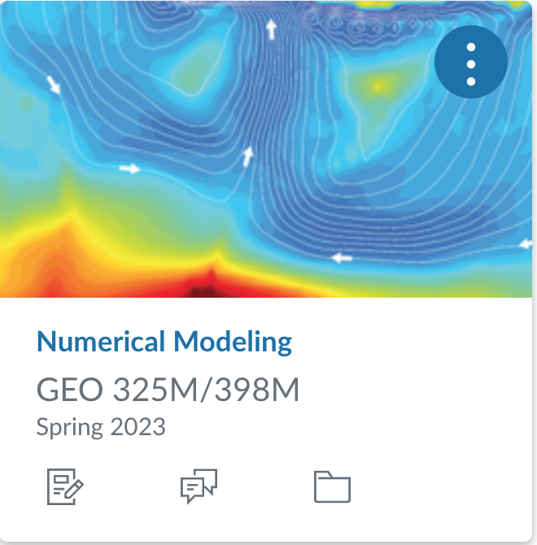
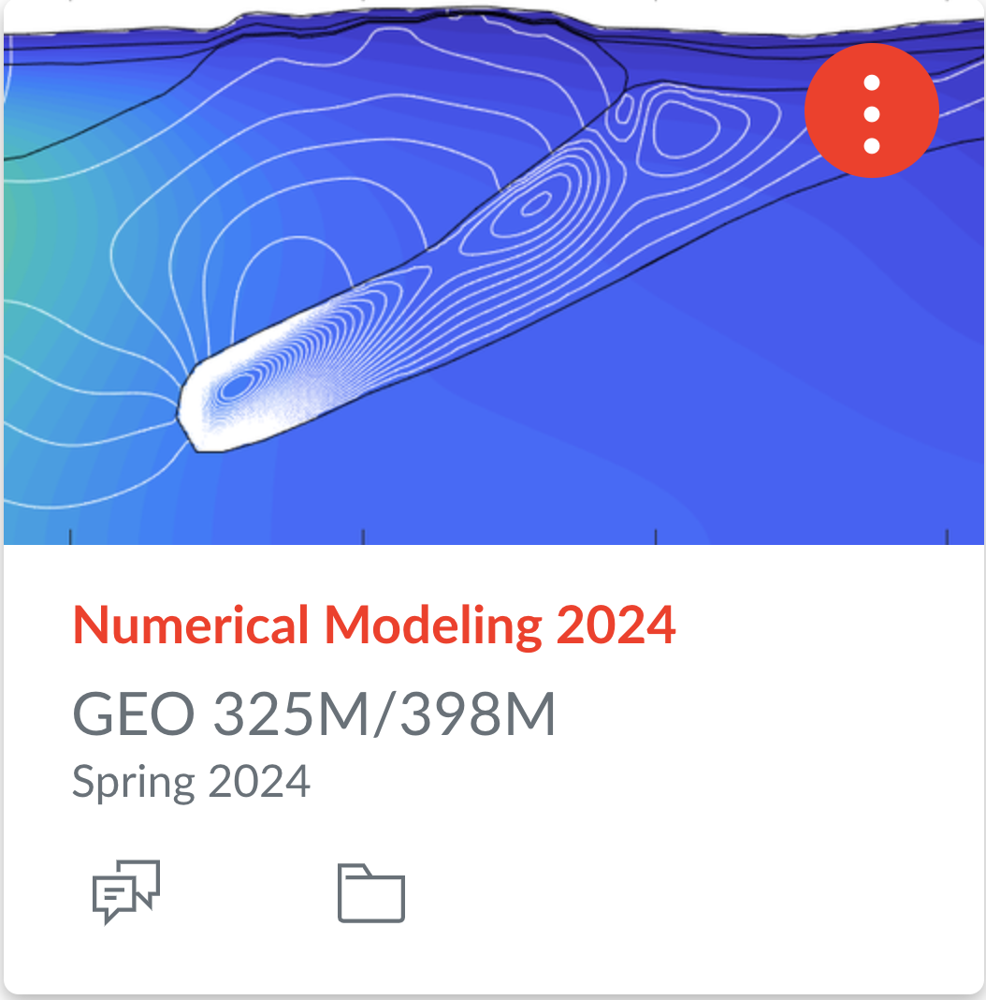

## Course Description

Covers numerical solution of dynamical problems arising in the solid earth geosciences. Entails development of individual codes in Matlab and application of codes to understanding heat transfer, wave propagation, elastic, and viscous deformations. Requires familiarity with Matlab. 
 
### Previous course projects:
        

The course content will be guided by a current research problem that typically leads to a scientific publication within the following year or two. In past classes we have worked on the following problems:

* [Spring 2018](Spring2018.md): Impact-induced cryovolcanism in Occator Crater on dwarf planet Ceres [[paper 1]](https://doi.org/10.1029/2018GL080327) [[paper 2]](https://www.nature.com/articles/s41550-020-1168-2)

* [Spring 2019](Spring2019.md): Transport of surface oxidants through Europa's ice shell [[paper 1]](https://agupubs.onlinelibrary.wiley.com/doi/abs/10.1029/2021GL095416)

* [Spring 2020](Spring2020.md): Convective upwelling in Europa's ice shell [[paper 1]](https://doi.org/10.1016/j.epsl.2021.116886) [[paper 2]](https://www.sciencedirect.com/science/article/pii/S2352340921003632?via%3Dihub)

* [Spring 2021](Spring2021.md): Mars groundwater response to impact cratering [[paper 1]](https://doi.org/10.1016/j.icarus.2023.115774)

* [Spring 2022](Spring2022.md): Two-phase convection in Europa's ice shell [paper in the works]

* [Spring 2023](Spring2023.md): Post-impact hydrothermal convection [paper in the works]
  
* Spring 2024: Preferential flow in infiltration  

### Office hours
*  Tue 3-4pm (in person JGB 4.216G)
*  Wed 11am-noon (in person JGB 5.220E)
* [Zoom ID 983 3529 1432](https://utexas.zoom.us/j/98335291432?pwd=aUlMUXl5S3BvRFBDc2ZkWTFkSDZrdz09) (password in email or on [Canvas](https://utexas.instructure.com/courses/1383942))

### Additional course websites:
* [Piazza](https://piazza.com/utexas/spring2024/geo325m398m/home) - Discussion board
* [Matlab Grader](https://grader.mathworks.com/courses/130296-geo-325m-398m-numerical-modeling-2024) - Homework (need accept email!)
* [Zoom ID 983 3529 1432](https://utexas.zoom.us/j/98335291432?pwd=aUlMUXl5S3BvRFBDc2ZkWTFkSDZrdz09) - Class (password in email or on [Canvas](https://utexas.instructure.com/courses/1383942))

### Matlab basics:
Here are some LiveScripts I prepared for the first class in 2018 that didn't have a Matlab prerequisite. If you don’t have much Matlab experience, please look through them. Vectorized programming is a particularly important topic.
1. [demo_arrays.mlx](matlab/demo_arrays.mlx) [[pdf]](matlab/demo_arrays.pdf)
2. [demo_functions.mlx](matlab/demo_functions.mlx) [[pdf]](matlab/demo_functions.pdf)
3. [demo_control_flow.mlx](matlab/demo_control_flow.mlx) [[pdf]](matlab/demo_control_flow.pdf)
4. [demo_matlab_functions.mlx](matlab/demo_matlab_functions.mlx) [[pdf]](matlab/demo_matlab_functions.pdf)
5. [demo_plotting.mlx](matlab/demo_plotting.mlx) [[pdf]](matlab/demo_plotting.pdf)
6. [demo_vectorized_programing.mlx](matlab/demo_vectorized_programing.mlx) [[pdf]](matlab/demo_vectorized_programing.pdf)
7. [demo_odds_ends.mlx](matlab/demo_odds_ends.mlx) [[pdf]](matlab/demo_odds_ends.pdf) (structures, logical indexing, anonymous functions)

Below are two files that I have sometimes used for the demos in class. If you put them into the folder with class files you should have no problem.
* [marc_colors.m](matlab/marc_colors.m)
* [set_demo_defaults.m](matlab/set_demo_defaults.m)

## This years course project
In spring 2024 we will develop a model for infiltration of rain water. We will start from the standard description of unsaturated flow given by Richards' equations. From there we can explore several extensions depending on time available. Options are: 1) Flow of soil gas, 2) Freezing and thawing soild, 3) Preferrential flow. 

## Introduction
### Lecture 1 (Jan 16): Course Project and Conservation Laws
* Lecture: [[pdf]](spring2024/GEO325M_2024_Lecture1.pdf) [[rec]](https://utexas.zoom.us/rec/share/nl0Apq9HjgFxROhSuflRO4ZnxIuFa8kE29dxttYlAeWljVOd7BCWMcR0E70Ojp95.ZkFyc9HnHNvPOUe2)
* Notes: [Introduction to porous media](modules/PorousMediaIntro.pdf)

### Lecture 2 (Jan 18): Balance laws
* Lecture: [[pdf]](spring2024/GEO325M_2024_Lecture2.pdf) [[rec]](https://utexas.zoom.us/rec/share/QH5lOsmUJgGxjXfNIirMdH8fP0FkM1qx9-rCHw4PEaPmgY5Pcq0AXcKWmGR9v6gb.N8eg_DZkM2b8Xt0l)
* Notes: [Balance Laws](spring2023/BalanceLaws.pdf), [Fluid Mass Blance](spring2023/FluidMassBalance.pdf)

### Lecture 3 (Jan 23): Introduction to numerics
* Lecture: [[pdf]](spring2024/GEO325M_2024_Lecture3.pdf) [[rec]](https://utexas.zoom.us/rec/share/A6GOhq4c3xp_ohHXCYlzoBoK6Lk9DFjA2KT7ZiVy1CRsiK7nuav911zMYC0oAdNp.nH-77LqxH_e6eIIB)
* Notes: [Incompressible Flow](spring2024/IncompressibleFlow.pdf), [Intro to Finite Differences](spring2024/Introduction_Finite_Differences.pdf), 
* LiveScripts: Finite Differences [[script]](spring2023/demo_intro_numerics.mlx) [[pdf]](spring2023/demo_intro_numerics.pdf), 

### Lecture 4 (Jan 25): Conservative Finite Differences
 * Lecture: [[pdf]](spring2024/GEO325M_2024_Lecture4.pdf) [[rec1]](https://utexas.zoom.us/rec/share/EKWJuU9TJBcjcAen3TI0043YYpiqTkpGALX9HYvaqhSqL4CKBo3Gr7av2o2b57cI.91nNusqs-_hTGeKd)
  [[rec2]](https://utexas.zoom.us/rec/share/15eu5Na4RUR3pDbFX5pYWHwbWulP2QKHS-G999XNrzPJcrNRkjLHKSXK83bcPLBj.bhj84eIOLYQKuYEY)
 * Notes: [Flow around well](spring2024/)
 * Live Scripts: Well Example [[script]](spring2023/demo_injection_well.mlx), [[pdf]](spring2023/demo_injection_well.pdf)

## 1D Saturated Flow (Poisson Equation)
### Lecture 5 (Jan 30): Discrete Operators
 * Lecture: [[pdf]](spring2024/GEO325M_2024_Lecture5.pdf)  [[rec]](https://utexas.zoom.us/rec/share/3MNcchNGb86a-G36O0Ug1k0FmJhGVh8Wq7RJZKYZSSYYJ8TgL31Oa6S_OpYw_PEP.ngs8v1jJ9pc1BiYE)
 * Notes: [Discrete operators in 1D](spring2023/DiscreteOps1D_2023.pdf)
 * Live Scripts: Discrete operators 1D [[script]](spring2023/demo_testing_ops.mlx) [[pdf]](spring2023/demo_testing_ops.pdf)

### Lecture 6 (Feb 1): Shallow Aquifer Model
* Lecture: [[pdf]](spring2024/GEO325M_2024_Lecture6.pdf) [[rec]](https://utexas.zoom.us/rec/share/7-KccdWrDjL9OyWfc8K-1vaYzZ6y8Af8gBRlz8O__6o64xcD3_SYTAqowtgrJhVf.VTYN51OLB0bivySa)
* Notes: [Shallow Aquifer Model](spring2023/ShallowAquiferModel_2023.pdf)
* Live Scripts: Danube Tisza Example [[script]](spring2023/DanubeTiszaInterfluve.mlx) [[pdf]](spring2023/DanubeTiszaInterfluve.pdf)

### Lecture 7 (Feb 6): Dirichlet Boundary Conditions
* Lecture: [[pdf]](spring2024/GEO325M_2024_Lecture7.pdf) [[rec]](https://utexas.zoom.us/rec/share/tHNpZAKkfFhC9yoD2-d0VMrVJMdYH3XeuipkWQe88Q_yvZpaYoVIEL8l3kzBMqyE._eZw9C-ium8os3Tb)
* Notes: Dirichlet BC: [homogeneous](spring2023/BC_Dirichlet_homo.pdf), [heterogeneous](spring2023/BC_Dirichlet_hetero.pdf)
* Live Scripts: Eliminating Constraints [[Script]](spring2024/demo_Dirichlet_head.mlx)  [[pdf]](spring2024/demo_Dirichlet_head.pdf)

### Lecture 8 (Feb 8): Effective conductivity of layered media
* Lecture: [[pdf]](spring2024/GEO325M_2024_Lecture8.pdf) [[rec]](https://utexas.zoom.us/rec/share/KU9RKWCCXSY31UjohqLT-8E4nnae-17b0lJKo7kYyl8wuTkOviz4MSnNT601szSR.HGP1NuUoNMKhhwP9)
* Notes: [Layered Media](spring2023/LayeredMedia.pdf)
* Live Scripts: Effective K [[script]](spring2023/demo_layered_media.mlx) [[pdf]](spring2023/demo_layered_media.pdf)

### Lecture 9 (Feb 13): Discretizing heterogenous coefficients
* Lecture: [[pdf]](spring2024/GEO325M_2024_Lecture9.pdf) [[rec]](https://utexas.zoom.us/rec/share/-fEwx2iu5K3mD7NFns2tZnssQTANb6BU5tJumTKYCJ_nRWi4L4V7INcYtUFd5Uw1.k1Kx4T110UGAivYq)
* Notes: [Variable coefficients](spring2023/Variable_coefficients_2022.pdf)
* Live Scripts: Variable Coefficients [[script]](spring2023/demo_heterogeneous_coefficients.mlx) [[pdf]](spring2023/demo_heterogeneous_coefficients.pdf), Radial Coordinates [[script]](spring2024/demo_radial_coords_flow.mlx)[[pdf]](spring2024/demo_radial_coords_flow.pdf)

### Lecture 10 (Feb 15): Fluxes and Flux Boundary condition
* Lecture: [[pdf]](spring2024/GEO325M_2024_Lecture10.pdf) [[rec]](https://utexas.zoom.us/rec/share/M5Ps2P7fSc8GFrwXefBfD3eLJ7jjiqwpPYCxGgweDvgFKT2fhrrd6krF_BdvWJ7Q.emV36XjDNxUHbehI)
* Notes: [Neumann BC's](spring2023/BC_Neumann2022.pdf), [Flux reconstruction](spring2023/ComputeFluxes2022.pdf)
* Live Scripts: Neuman BC's [[script]](spring2023/demo_NeumannBCs.mlx) [[pdf]](spring2023/demo_NeumannBCs.pdf), Fluxes [[script]](spring2023/demo_comp_flux_res.mlx) [[pdf]](spring2023/demo_comp_flux_res.pdf)

## 2D Saturated flow
### Lecture 11 (Feb 20): 2D Discrete operators - Part I
* Lecture: [[pdf]](spring2024/GEO325M_2024_Lecture11.pdf) [[rec]](https://utexas.zoom.us/rec/share/MNENqn48FJNfFLR94ZpRWrkLboPPkwXenvMeeqgAHDr2j_8G2ljyw96mlfGlmsyS.QVzH3lN8ltBwAqTR)
*  Notes: [Discrete Operators](spring2023/DiscreteOperators2D_2023.pdf)
* Live Scripts: 2D Matlab basics [[script]](spring2023/demo_2d_basicsmlx) [[pdf]](spring2023/demo_2d_basics.pdf), 2D Discrete Ops [[script]](spring2023/demo_2d_ops.mlx) [[pdf]](spring2023/demo_2d_ops.pdf)

### Lecture 12 (Feb 22): 2D Discrete operators - Part II
* Lecture: [[pdf]](spring2024/GEO325M_2024_Lecture12.pdf) [[rec]](https://utexas.zoom.us/rec/share/jTKkmsGtuyO3vakYuPmZJTpjAZGUNgo4HEtmofAMc1bz3nnGIKTy6Rw4JOH4Bgv0.zEw91R-TDGixQ6Sb)
* Live Scripts: Transition 1D to 2D: [[script]](spring2023/demo_transition2D_2023.mlx), [[pdf]](spring2023/demo_transition2D_2023.pdf)

### Lecture 13 (Feb 27): Streamlines and Streamfunction
* Lecture: [[pdf]](spring2024/GEO325M_2024_Lecture13.pdf) [[rec]](https://utexas.zoom.us/rec/share/WWUS8QvThXobBXv7b-bKJq5k_lfCHByEhADc6vQEYSu3StooTjTdSTEMqs-xbsOH.BJWjGu_fCwpbCzvH)
* Notes: [Streamlines](spring2023/Streamlines.pdf)

### Lecture 14 (Feb 29): Numerical Streamfunction
* Lecture: [[pdf]](spring2024/GEO325M_2024_Lecture14.pdf) [[rec]](https://utexas.zoom.us/rec/share/Vis3OoJX1bV0LM1xWAb_6P5qjCT4tlYXnuIikGxoJBhk48dOscLvWg-LYDySGqXB.hRdPJRMF0QmFFfKk)
* LiveScripts:

### Lecture 15 (Mar 5): Correlated Random Fields
* Lecture: [[pdf]](spring2024/GEO325M_2024_Lecture15.pdf) [[rec]](https://utexas.zoom.us/rec/share/fRkuPuT1SAAGyg7yFWLXlCb7KTIJvhEeWzi0qUJ_0CzF0Hp8AdHs8sx7LQKRlz4.Z8NLVz7E8_2a_nEs)
* Notes: [Correlated Random Fields](spring2024/CorrelatedRandomFields.pdf)
* LiveScripts:
  
### Lecture 16 (Mar 7): 
## 1D Unsaturated flow
