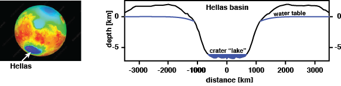

## Course Description

Covers numerical solution of dynamical problems arising in the solid earth geosciences. Entails development of individual codes in Matlab and application of codes to understanding heat transfer, wave propagation, elastic, and viscous deformations. Requires familiarity with Matlab.
## Office hours
Monday 9-10am: [Zoom ID 983 3529 1432](https://utexas.zoom.us/j/98335291432?pwd=aUlMUXl5S3BvRFBDc2ZkWTFkSDZrdz09) (password in email or on [Canvas](https://utexas.instructure.com/courses/1299932))

## Additional course websites:
* [Piazza](https://piazza.com/class/kk21516n1yz51t) - Discussion board
* [Matlab Grader](https://grader.mathworks.com/courses/31920-geo-325m-398m-numerical-modeling-2021) - Homework (need accept email!)
* [Zoom ID 983 3529 1432](https://utexas.zoom.us/j/98335291432?pwd=aUlMUXl5S3BvRFBDc2ZkWTFkSDZrdz09) - Class (password in email or on [Canvas](https://utexas.instructure.com/courses/1299932))

## Previous course projects:
  

The course content will be guided by a current research problem that typically leads to a scientific publication within the following year. Past classes following problems:

* [Spring 2018](Spring2018.md): Impact-induced cryovolcanism in Occator Crater on dwarf planet Ceres 

* [Spring 2019](Spring2019.md): Transport of surface oxidants through Europa's ice shell

* [Spring 2020](Spring2020.md): Model convective upwelling in Europa's ice shell

## This years course project
In spring 2021 we will develop a model for the response of Martian groundwater to very large asteroid impacts that instantaneously generate basins kilometers deep and thousands of kilometers wide, see sketch below. These events have the potential to alter groundwater levels over very large areas and for long times. The basisns likely host long-lived hydrothermals systems that provide a habitable environment as well as large lakes.

* Review paper on Habitability of Mars [Westall et al. 2013](papers/Westall2013.pdf)
* Review paper on Impacts and Origin of Life [Osinski et al. 2020](papers/Osinski2020.pdf)
* TED talk by Nathalie Cabrol on Life on Mars [[Link]](https://www.ted.com/talks/nathalie_cabrol_how_mars_might_hold_the_secret_to_the_origin_of_life?language=en)

## Matlab basics:
Here are some LiveScripts I prepared for the first class in 2018 that didn't have a Matlab prerequisite. If you don’t have much Matlab experience, please look through them. Vectorized programming is a particularly important topic.
1. [demo_arrays.mlx](matlab/demo_arrays.mlx) [[pdf]](matlab/demo_arrays.pdf)
2. [demo_functions.mlx](matlab/demo_functions.mlx) [[pdf]](matlab/demo_functions.pdf)
3. [demo_control_flow.mlx](matlab/demo_control_flow.mlx) [[pdf]](matlab/demo_control_flow.pdf)
4. [demo_matlab_functions.mlx](matlab/demo_matlab_functions.mlx) [[pdf]](matlab/demo_matlab_functions.pdf)
5. [demo_plotting.mlx](matlab/demo_plotting.mlx) [[pdf]](matlab/demo_plotting.pdf)
6. [demo_vectorized_programing.mlx](matlab/demo_vectorized_programing.mlx) [[pdf]](matlab/demo_vectorized_programing.pdf)
7. [demo_odds_ends.mlx](matlab/demo_odds_ends.mlx) [[pdf]](matlab/demo_odds_ends.pdf) (structures, logical indexing, anonymous functions)

Below are two files that I have sometimes used for the demos in class. If you put them into the folder with class files you should have not problem.
* [marc_colors.m](matlab/marc_colors.m)
* [set_demo_defaults.m](matlab/set_demo_defaults.m)

## Lecture Notes
### Lecture 1 (Jan 19): Introduction
* [Lecture 1](modules/GEO325M_Lecture1.pdf)
* [Course Introduction](modules/CourseIntro.pdf)
* [Course Project 2021](modules/ClassProject_2021.pdf)
* [Intoduction to porous media](modules/PorousMediaIntro.pdf)

### Lecture 2 (Jan 21): Incompressible single phase flow
* [Lecture 2](modules/GEO_325M__Lecture_2.pdf)
* [Balance Laws](modules/BalanceLaws.pdf)
* [Fluid mass balance](modules/FluidMassBalance.pdf)
* [Incompressible flow](modules/IncompressibleFlow.pdf)

### Lecture 3 (Jan 26): Conservative Finite Differences
* [Lecture 3](modules/GEO_325M_Lecture3.pdf)
* Review Finite Differences [[LiveScript]](matlab/demo_intro_numerics.mlx) [[pdf]](matlab/demo_intro_numerics.pdf)
* [Conservative Finite Differences](modules/ConservativeFiniteDifferences.pdf)
* Demos: Checkerboard pattern [[Matlab]](matlab/demo_checkerboard.m), FD vs. CFD [[Matlab]](matlab/demo_compare_FD_FV.m)

### Lecture 4 (Jan 28): Discrete Differential Operators
* [Lecture 4](modules/GEO_325M_Lecture4.pdf)
* [Discrete operators](modules/DiscreteOps1D.pdf)
* Demo operators: [[LiveScript]](matlab/demo_testing_ops.mlx) [[pdf]](matlab/demo_testing_ops.pdf)

### Lecture 5 (Feb 2): Southern highlands aquifer
* [Lecture 5](modules/GEO325M_Lecture5.pdf)
* Southern highlands aquifer: [[LiveScript]](matlab/HighLandAquiferIntro.mlx) [[pdf]](matlab/HighLandAquiferIntro.pdf)
* [Scaling confined linear aquifer](modules/ScalingConfinedAquifer.pdf)

### Lecture 6 (Feb 4): Boundary Conditions - Part I
* [Lecture 6](modules/GEO325M_Lecture6.pdf)
* [Homogeneous Dirichlect BCs](modules/BC_Dirichlet_homo.pdf)
* Demo Dirichlet BCs: [[LiveScript]](matlab/demo_BC_Dirichlet.mlx) [[pdf]](matlab/demo_BC_Dirichlet.pdf)

### Lecture 7 (Feb 9): Boundary Conditions - Part II
* Lecture 7: [[pdf]](modules/GEO325M_Lecture7.pdf) [[video]](https://utexas.zoom.us/rec/share/O3JcL4CftF56f7wwEtSnJbIkb0Kiy3TShA7nPYbNMvzQpid5vn9sv4IifX294D25.cA4yVsy_DxTVb3kU?startTime=1612884740000)
* [Heterogeneous BCs](modules/BC_Dirichlet_hetero.pdf)
* [Solving Linear Boundary Value Problems (LBVPs)](modules/SolvingLBVPs.pdf)
* Layered Media: [[LiveScript]](matlab/demo_layered_media.mlx) [[pdf]](matlab/demo_layered_media.pdf)

### Lecture 8 (Feb 11): Layered media and heterogeneous coefficients
* Lecture 8: [[pdf]](modules/GEO325M_Lecture8.pdf) [video](https://utexas.zoom.us/rec/share/K61MqQHsr_VVMF8NSoFjtiOGIvDZXmsK2oyzj83Xdk8MfKbcHTTvYXhfvNOipsMV.Qyid96-7GpKPqzgV?startTime=1613058001000)
* Layered Media: [[LiveScript]](matlab/demo_layered_media.mlx) [[pdf]](matlab/demo_layered_media.pdf)
* Mean aquifer properties: [[liveScript]](matlab/MarsAquiferMeanProp.mlx)  [[pdf]](matlab/MarsAquiferMeanProp.pdf)
* [Variable coefficients](modules/Variable_coefficients.pdf)

### Class cancelled Feb 16, Feb 18 and Feb 23 (stay warm!)

### Lecture 9 (Feb 25): Fluxes and Neumann BC's
* Lecture 9: [[pdf]](modules/GEO325M_Lecture9.pdf)
* [Aquifer with precipitation and polar recharge](modules/Aquifer_with_precipitation_and_polar_recharge.pdf)
* [Neumann BCs](modules/BC_Neumann2021.pdf)
* Demo Neumann: [[LiveScript]](matlab/LinearConfinedAquiferWithPolarRecharge.mlx) [[pdf]](matlab/LinearConfinedAquiferWithPolarRecharge.pdf)
* Flux computation: [[LiveScript]](matlab/FluxComputation.mlx) [[pdf]](matlab/FluxComputation.pdf)

### Lecture 10 (Mar 2): Cylindrical and spherical-shell coordinates
* Lecture 10: [[pdf]](modules/GEO325M_Lecture10.pdf)
* Cylindrical coordinates: [[LiveScript]](matlab/demo_radial_polar_recharge.pdf) [[pdf]](matlab/demo_radial_polar_recharge.pdf)
* Spherical shell coordinates: [[LiveScript](matlab/demo_sperical_shell_precipitation.mlx) [[pdf]](matlab/demo_sperical_shell_precipitation.pdf)
* [Analytical solution - cylindrical geometry with polar recharge](modules/Cylindrical_with_polar_recharge.pdf)
* [Analytical solution - spherical shell with precipitation](modules/Spherical_shell_confined_precipitation.pdf)

### Lecture 11 (Mar 4): Slightly compressible flow
* Lecture 11: [[pdf]](modules/GEO325M_Lecture11.pdf)
* [Slightly compressible flow](modules/Slightly_compressible_flow.pdf)

### Lecture 12 (Mar 9): Time stepping and numerical stability
* Lecture 12: [[pdf]](modules/GEO325M_Lecture12.pdf)
* [Time integration](modules/Time_integration.pdf)
* Theta-method: [[LiveScript]](matlab/demo_timestepping.mlx) [[pdf]](matlab/demo_timestepping.pdf)
* [Transient spherical cap aquifer](modules/Transient_spherical_cap_aquifer.pdf)
* Transient aquifer: [[LiveScript]](matlab/demo_transient_aquifer.mlx) [[pdf]](matlab/demo_transient_aquifer.pdf)

### Lecture 13 (Mar 11): Self-similar diffusion - linear
* Lecture 13: [[pdf]](modules/GEO325M_Lecture13.pdf)
* [Transient drainage of confined aquifer](modules/Transient_drainage_of_confined_linear_aquifer.pdf)
* [Transient recharge of confined aquifer](modules/Transient_recharge_confined_linear_aquifer.pdf)
 
### No class Mar 16 and 18 (Spring break)

### Lecture 14 (Mar 23): Unconfined flow & Newton-Raphson Method
* Lecture 14: [[pdf]](modules/GEO325M_Lecture14.pdf)
* [Unconfined flow](modules/Unconfined_flow.pdf)
* [Newton-Raphson method](modules/Newton-Raphson_method.pdf)

### Lecture 15 (Mar 25): Non-linear problems - steady
* Lecture 15: [[pdf]](modules/GEO325M_Lecture15.pdf)
* Demo Newton-Raphson: [[LiveScript]](matlab/demo_Newton_intro.mlx) [[pdf]](matlab/demo_Newton_intro.pdf)
* [Jacobian for unconfined flow](modules/Jacobian_for_unconfined_flow.pdf)
