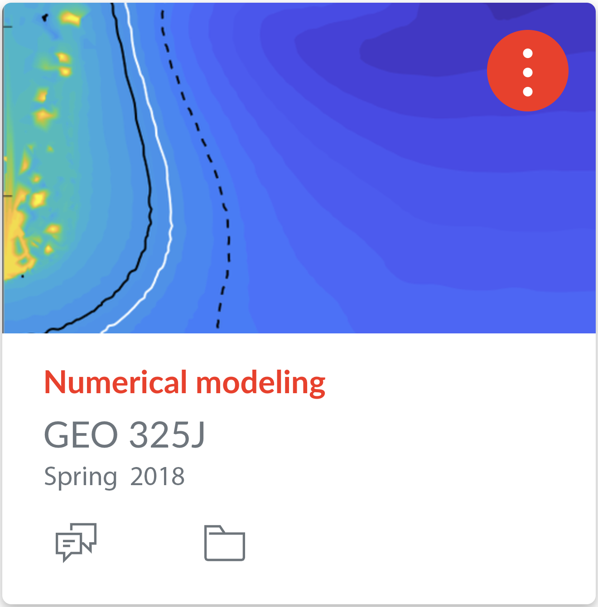
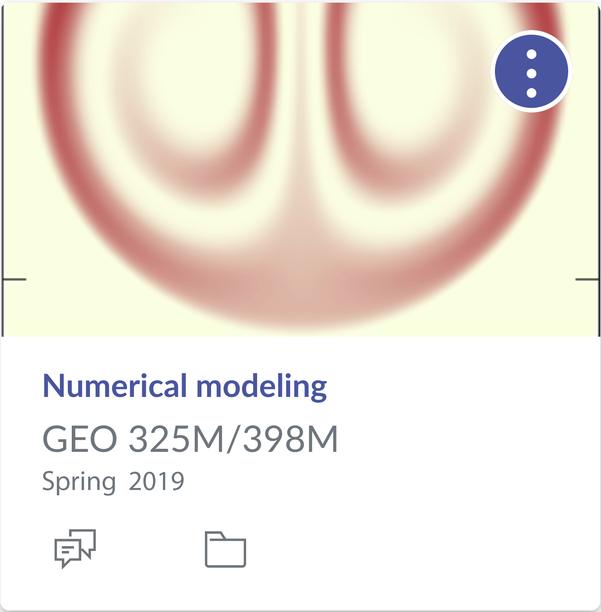
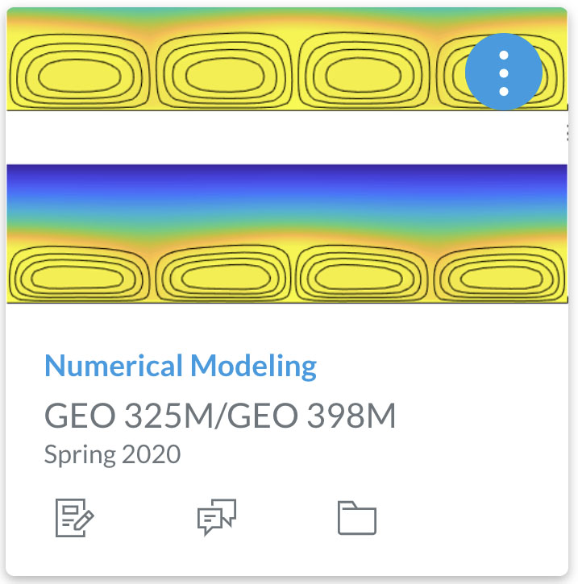
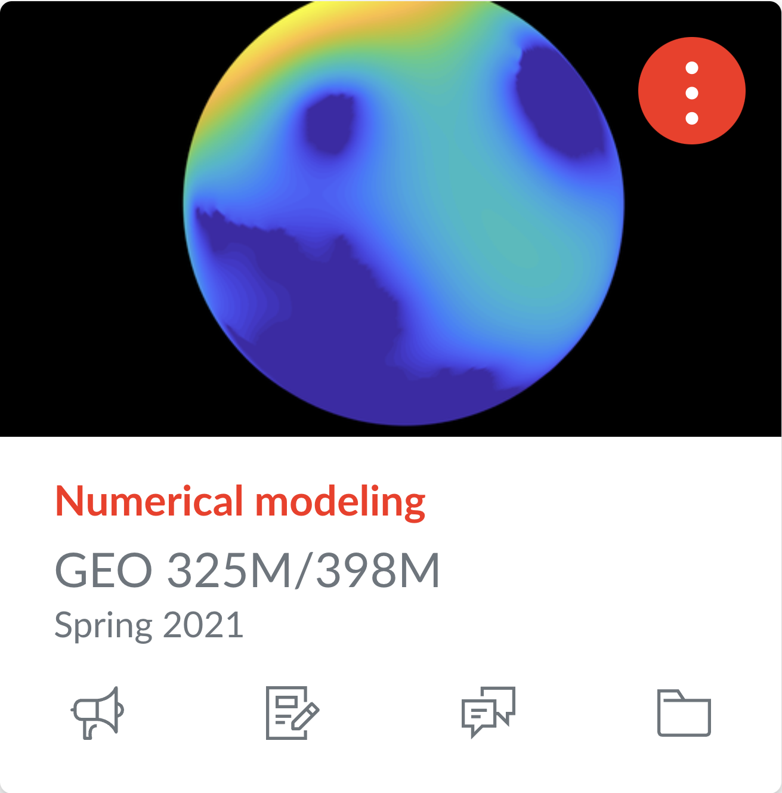
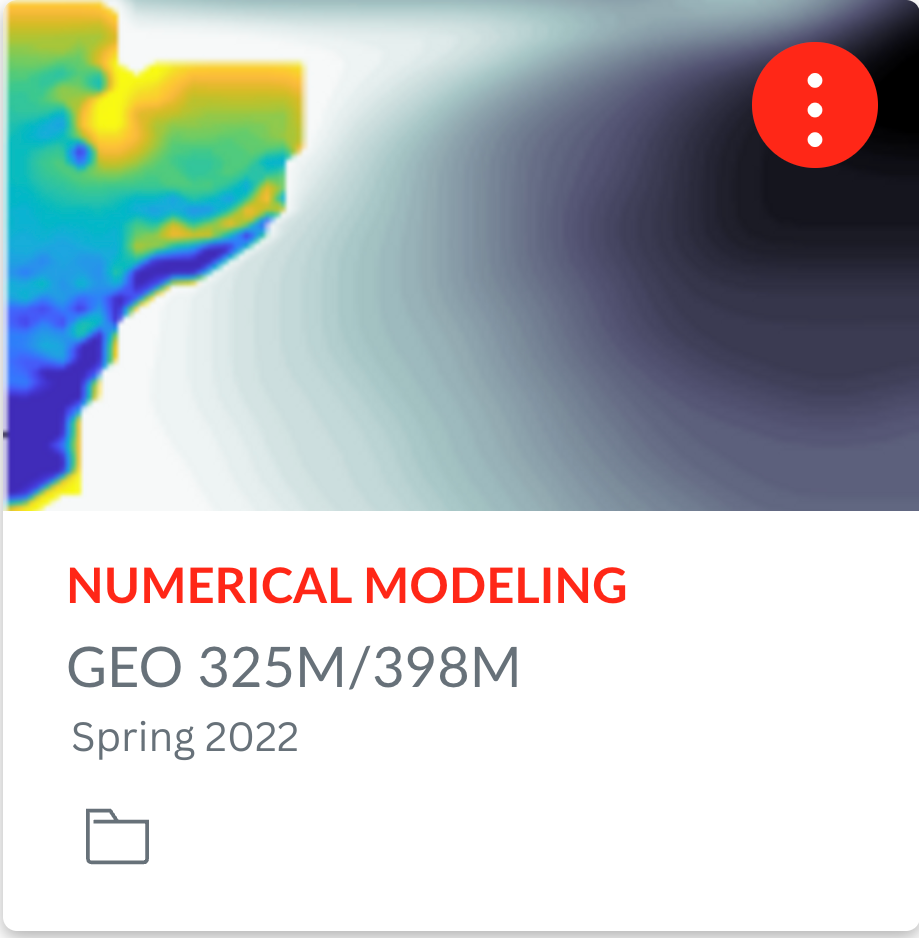
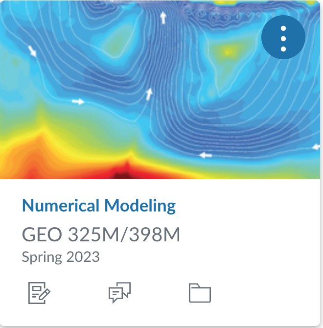
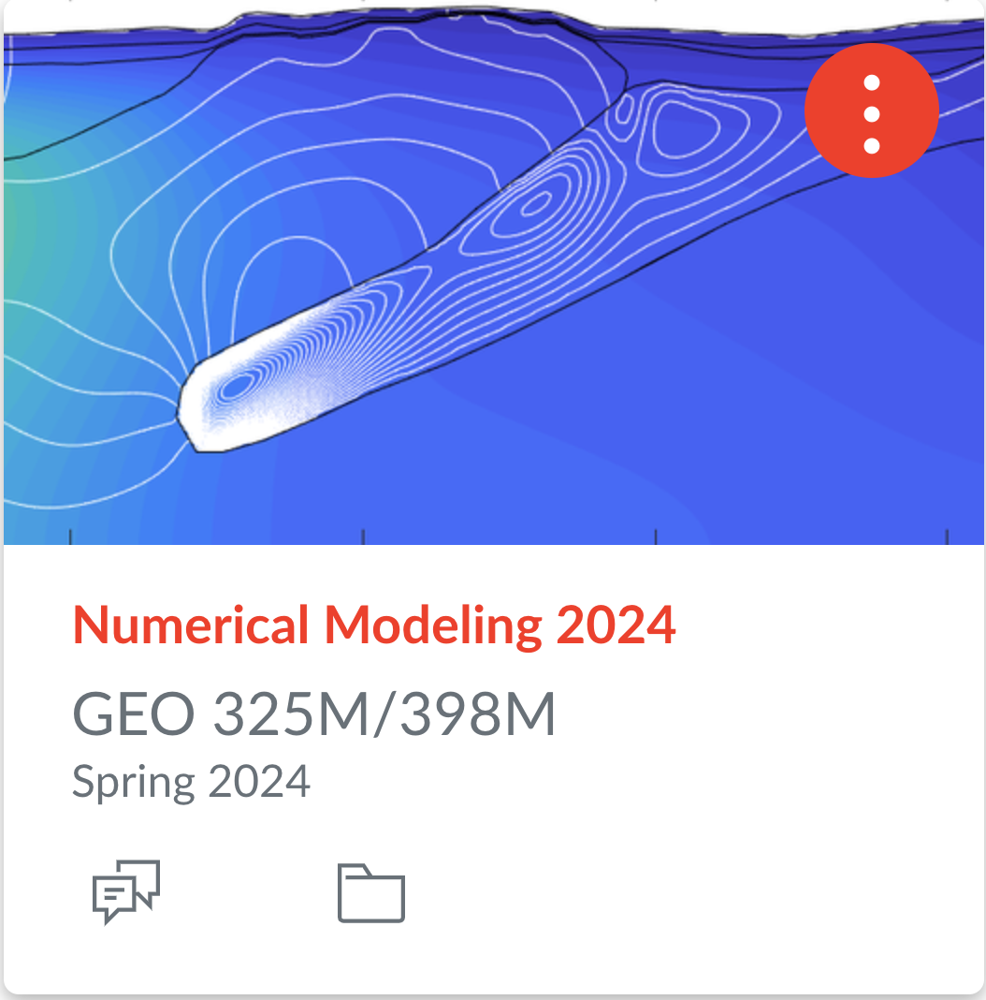
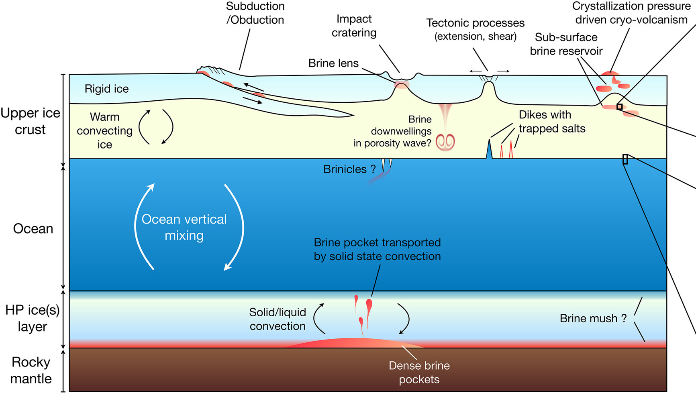

## Course Description

Covers numerical solution of dynamical problems arising in the solid earth geosciences. Entails development of individual codes in Matlab and application of codes to understanding heat transfer, wave propagation, elastic, and viscous deformations. Requires familiarity with Matlab. 

[Syllabus](spring2025/GEO325M_Syllabus_2025.pdf)
 
### Previous course projects:
       

  

The course content will be guided by a current research problem that typically leads to a scientific publication within the following year or two. In past classes we have worked on the following problems:

* [Spring 2018](Spring2018.md): Impact-induced cryovolcanism in Occator Crater on dwarf planet Ceres [[paper 1]](https://doi.org/10.1029/2018GL080327) [[paper 2]](https://www.nature.com/articles/s41550-020-1168-2)

* [Spring 2019](Spring2019.md): Transport of surface oxidants through Europa's ice shell [[paper 1]](https://agupubs.onlinelibrary.wiley.com/doi/abs/10.1029/2021GL095416)

* [Spring 2020](Spring2020.md): Convective upwelling in Europa's ice shell [[paper 1]](https://doi.org/10.1016/j.epsl.2021.116886) [[paper 2]](https://www.sciencedirect.com/science/article/pii/S2352340921003632?via%3Dihub)

* [Spring 2021](Spring2021.md): Mars groundwater response to impact cratering [[paper 1]](https://doi.org/10.1016/j.icarus.2023.115774)

* [Spring 2022](Spring2022.md): Two-phase convection in Europa's ice shell [paper submitted]

* [Spring 2023](Spring2023.md): Post-impact hydrothermal convection [paper almost done - so close, really!]
  
* [Spring 2024](Spring2024.md): Preferential flow in infiltration [paper in the works]

* Spring 2025: Convection of high-pressure ice

### Class rooom and time
* Tue/Th 9:30am - 11:00am in JGB 3.120 in person

### Office hours
*  Mon noon-1pm - Geophysics Dojo (JGB 4.216): Soraya's and Mbarak's office hours
*  Wed noon-1pm - Geophysics Dojo (JGB 4.216): Marc's office hours

### Additional course websites:
* [Piazza](https://piazza.com/class/m5psdq6pfcm372) - Discussion board
* [Matlab Grader](https://grader.mathworks.com/courses/164028-geo-325m-398m-numerical-modeling-2025) - Homework (need accept email!)
* [Canvas](https://utexas.instructure.com/courses/1409952) - Just for grades.

### Matlab basics:
Here are some LiveScripts I prepared for the first class in 2018 that didn't have a Matlab prerequisite. If you don’t have much Matlab experience, please look through them. Vectorized programming is a particularly important topic.
1. [demo_arrays.mlx](matlab/demo_arrays.mlx) [[pdf]](matlab/demo_arrays.pdf)
2. [demo_functions.mlx](matlab/demo_functions.mlx) [[pdf]](matlab/demo_functions.pdf)
3. [demo_control_flow.mlx](matlab/demo_control_flow.mlx) [[pdf]](matlab/demo_control_flow.pdf)
4. [demo_matlab_functions.mlx](matlab/demo_matlab_functions.mlx) [[pdf]](matlab/demo_matlab_functions.pdf)
5. [demo_plotting.mlx](matlab/demo_plotting.mlx) [[pdf]](matlab/demo_plotting.pdf)
6. [demo_vectorized_programing.mlx](matlab/demo_vectorized_programing.mlx) [[pdf]](matlab/demo_vectorized_programing.pdf)
7. [demo_odds_ends.mlx](matlab/demo_odds_ends.mlx) [[pdf]](matlab/demo_odds_ends.pdf) (structures, logical indexing, anonymous functions)

Below are two files that I have sometimes used for the demos in class. If you put them into the folder with class files you should have no problem.
* [marc_colors.m](matlab/marc_colors.m)
* [set_demo_defaults.m](matlab/set_demo_defaults.m)

## This years course project
In spring 2025 we will develop a model for the convection in high-pressure ice in icy ocean worlds that may controll the transfer of nutrients from the rocky interior into the ocean sandwiched between the layers of high and low pressure ice.

For reference see [[Vance at al. 2020]](papers/Vance2021.pdf)

## Introduction

### Lecture 1 (Jan 14): Course Project and Conservation Laws
* [Intro slides](spring2025/CourseIntro2025.pdf), [Class project](spring2025/ClassProject_2025.pdf)
* Notes: [Balance Laws](spring2023/BalanceLaws.pdf), [Energy Balance](spring2025/Energy_Balance_Simple.pdf)

### Lecture 2 (Jan 16): Introduction to numerics
* Lecture: [recording](https://utexas.zoom.us/rec/share/PhI2mjhJgUj4BwlXqx4X5_ihQcrIdm-2fNZ6rV1RkC2voibnkXYFgPpfNNldc0Q.TzO1hYlw38-ZrRl_), [board](spring2025/GEO325M_2025_Lecture2.pdf)
* Notes: [Intro to Finite Differences](spring2024/Introduction_Finite_Differences.pdf), 
* LiveScripts: Finite Differences [[script]](spring2023/demo_intro_numerics.mlx) [[pdf]](spring2023/demo_intro_numerics.pdf),

### Lecture 3 (Jan 21): Conservative Finite Differences
* Lecture: [recording](https://utexas.zoom.us/rec/share/4fxzQ4FG3PTZ8nc3XSE2indERGmfUmi5TAJeEUBhnckpRWLBhQQy2GH0iBs_Qm9k.C03c40axfiRfbtmJ), [board](spring2025/GEO325M_2025_Lecture3.pdf)
* Notes: [Consrevative Finite Differences](spring2025/ConservativeFiniteDifferences_HeatFlow.pdf)
* Live Scripts: Volcanic Conduit Heat Flow [[script]](spring2025/demo_volcanic_pipe.mlx), [[pdf]](spring2025/demo_volcanic_pipe.pdf)

## 1D Heat Flow

### Lecture 4 (Jan 23): Discrete Operators
* Notes: [Discrete operators in 1D](spring2023/DiscreteOps1D_2023.pdf)
* Live Scripts: Discrete operators 1D [[script]](spring2025/demo_testing_ops.mlx) [[pdf]](spring2025/demo_testing_ops.pdf)

### Lecture 5 (Jan 28): Boundary Conditions I: Dirichlet homogeneous
* Notes: [Dirichlet BC's](spring2025/BC_Dirichlet_2025.pdf)

### Lecture 6 (Jan 30): Boundary Conditions II: Dirichlet heterogenous
* Notes: [Dirichlet BC's](spring2025/BC_Dirichlet_2025.pdf) - same as lecture 5
* Live Scripts: Geotherm with Dirichlet BC's [[script]](spring2025/demo_Dirichlet_heat_flux.mlx), [[pdf]](spring2025/demo_Dirichlet_heat_flux.pdf)

### Lecture 7 (Feb 4): Boundary Conditons III: Neumann
* Notes: [Neuman BC's](spring2025/Neumann_BCs_heat_2025.pdf), [Compute Fluxes](spring2025/ComputeFluxes_heat_2025.pdf), [Conservative Source](spring2025/ConservativeSource.pdf)
* Live Scripts: Geotherm with mixed BC's [[script]](spring2025/demo_ContinentalGeotherm.mlx), [[pdf]](spring2025/demo_ContinentalGeotherm.pdf) 

### Lecture 8 (Feb 6): Heterogenous coefficients and layered media
* Notes: [Layered Media](spring2023/LayeredMedia.pdf), [Variable coefficients](spring2023/Variable_coefficients_2022.pdf)
* Live Scripts: Layered Media [[script]](spring2025/demo_layered_media_heat.mlx) [[pdf]](spring2025/demo_layered_media_heat.pdf), Variable coefficients [[script]](spring2025/demo_heterogeneous_coefficients_heat.mlx) [[pdf]](spring2025/demo_heterogeneous_coefficients_heat.pdf)

### Lecture 9 (Feb 11): Non-linear problems and Netwon-Raphson method
* Notes: [Steady non-linear heat conduction](spring2025/NonLinearConduction.pdf), [Newton-Raphson method](spring2025/Newton-Raphson_method.pdf)
* Live Scripts: Europa ice shell [[script]](spring2025/demo_NonLinearConduction.mlx) [[pdf]](spring2025/demo_NonLinearConduction.pdf), Newton-Raphson iteration [[script]](spring2025/demo_Newton_intro.mlx) [[pdf]](spring2025/demo_Newton_intro.pdf)

### Lecture 10 (Feb 13): Numerical Jscobian
* Notes: [Numerical Jacobian]() 
* Live scripts: Numerical Jacobian [[script]](spring2025/demo_jacobian_heat_steady_analytic.mlx) [[pdf]](spring2025/demo_jacobian_heat_steady_analytic.pdf)
  
### Lecture 11 (Feb 18): Analytic Jacobian
* Notes: [Analytical Jacobian](spring2025/Jacobian_heat_steady_analytic.pdf)
* Live script: Analytic Jacobian [[script]](spring2025/demo_jacobian_heat_steady_analytic.mlx) [[pdf]](spring2025/demo_jacobian_heat_steady_analytic.pdf)
  
### Lecture 12 (Feb 20): Transient heat transport
* Lecture: [Transcript](spring2025/GEO325M_2025_Lecture12.pdf), [video](https://utexas.zoom.us/rec/share/bAfdSzaJEOm7jnlOScVVVn4NtPFvZeA7GSkYpz4IWgrp3trXdA405JvX1CKpfS2Y.dLrRdrK2NPPqjmuo)
* Time stepping: [[LiveScript](spring2020/demo_timestepping.mlx) [[pdf]](spring2020/demo_timestepping.pdf)
* Planetesimal Thermal Evolution: [[LiveScript]](spring2020/demo_PlanetesimalThermalEvolution.mlx) [[pdf]](spring2020/demo_PlanetesimalThermalEvolution.pdf)

## 1D ADVECTIVE-CONDUCTIVE HEAT TRANSFER
### Lecture 13 (Feb 25): Advective heat transport
* Example: [[LiveScript]](spring2020/demo_GeothermErosionDeposition.mlx) [[pdf]](spring2020/demo_GeothermErosionDeposition.pdf)
* Notes: [Upwind method](spring2024/DiscretizationAdvective.pdf)
* LiveScripts: Advection in 1D [[script]](spring2024/demo_ADE_discretization.mlx) [[pdf]](spring2024/demo_ADE_discretization.pdf)

* [Discretization of Advection](modules/DiscretizationAdvective.pdf)

### Lecture 14 (Feb 27): Time stepping ADE
* Discretization of Advection-Diffusion Equation: [[LiveScript]](spring2020/demo_ADE_discretization.mlx) [[pdf]](spring2020/demo_ADE_discretization.pdf)
* [Numerical Diffusion](spring2020/NumericalDiffusion.pdf)

## DISCRETIZATION IN 2D
### Lecture 15 (Mar 4): 2D Discrete operators - Part I
*  Notes: [Discrete Operators](spring2023/DiscreteOperators2D_2023.pdf)
* Live Scripts: 2D Matlab basics [[script]](spring2023/demo_2d_basicsmlx) [[pdf]](spring2023/demo_2d_basics.pdf), 2D Discrete Ops [[script]](spring2023/demo_2d_ops.mlx) [[pdf]](spring2023/demo_2d_ops.pdf)

### Lecture 16 (Mar 6): 2D Discrete operators - Part II
* Live Scripts: Transition 1D to 2D: [[script]](spring2023/demo_transition2D_2023.mlx), [[pdf]](spring2023/demo_transition2D_2023.pdf)

### No class Mar 11!

### Lecture 17 (Mar 13): 2D Advection matrix - Cooling of oceanic plates
* Notes: [Assembly of 2D advection matrix](spring2020/DiscretizationAdvection2D_kron.pdf)
* Example: Cooling of the oceanic plate: [[LiveScript]](spring2025/demo_oceanic_plate_cooling.mlx) [[pdf]](spring2025/demo_oceanic_plate_cooling.pdf)

## STOKES FLOW  
### Lecture 18 (Mar 25): Derivation of Stokes equation
* [Navier Stokes Equations](spring2020/NavierStokesEquations.pdf), [Scaling and reduction to Stokes Equation](spring2025/StokesEquations.pdf)

### Lecture 19 (Mar 27): Staggered grid for Stress/Strain
* [Staggered Grid and Discrete Operators](spring2020/StokesGrid.pdf)

### Lecture 20 (Apr 1): Discrete Stokes operators
* [Discrete Stokes Operators](spring2020/StokesOps.pdf)
  
### Lecture 21 (Apr 3): Stokes boundary conditions & Lid-driven Cavity
* LiveScripts: Stokes BCs [[script]](spring2022/demo_stokes_bc.mlx)  [[pdf]](spring2022/demo_stokes_bc.pdf), Lid-driven cavity (slip) [[script]](spring2022/demo_LidDrivenCavity_slip.mlx) [[pdf]](spring2022/demo_LidDrivenCavity_slip.pdf)
  
### Lecture 22 (Apr 8): Streamfunction
* Notes: [Streamlines](spring2023/Streamlines.pdf), [Numerical Streamfunction](spring2020/Streamfunction_numerical.pdf)

### Lecture 23 (Apr 10): Coupled Stokes flow and heat transport - Mid-ocean ridges
* [Thermal boundary layer](spring2020/ThermalBoundaryLayer.pdf)

### Lecture 24 (Apr 15): Variable viscosity Stokes flow
* Notes: [Couette flow with temperature gradient](spring2022/CouetteFlow_TemperatureGradient.pdf), [Discretize variable viscosity](spring2022/VariableViscosityNumerical.pdf)

## Convection in high-pressure ices

### Lecture 25 (Apr 17): Rayleigh-Bernard convection

### Lecture 26 (Apr 22): Implementing convection

### Lecture 27 (Apr 24): Class review & Discussion

  
