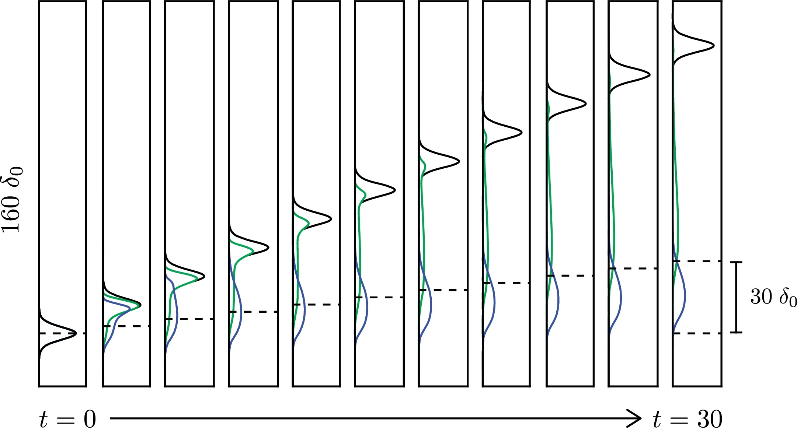

## Course Description

Covers numerical solution of dynamical problems arising in the solid earth geosciences. Entails development of individual codes in Matlab and application of codes to understanding heat transfer, wave propagation, elastic, and viscous deformations. Requires familiarity with Matlab. 

[Syllabus](spring2026/Syllabus2026.pdf)
 
### Previous course projects:
       

  

The course content will be guided by a current research problem that typically leads to a scientific publication within the following year or two. In past classes we have worked on the following problems:

* [Spring 2018](Spring2018.md): Impact-induced cryovolcanism in Occator Crater on dwarf planet Ceres [[paper 1]](https://doi.org/10.1029/2018GL080327) [[paper 2]](https://www.nature.com/articles/s41550-020-1168-2)

* [Spring 2019](Spring2019.md): Transport of surface oxidants through Europa's ice shell [[paper 1]](https://agupubs.onlinelibrary.wiley.com/doi/abs/10.1029/2021GL095416)

* [Spring 2020](Spring2020.md): Convective upwelling in Europa's ice shell [[paper 1]](https://doi.org/10.1016/j.epsl.2021.116886) [[paper 2]](https://www.sciencedirect.com/science/article/pii/S2352340921003632?via%3Dihub)

* [Spring 2021](Spring2021.md): Mars groundwater response to impact cratering [[paper 1]](https://doi.org/10.1016/j.icarus.2023.115774)

* [Spring 2022](Spring2022.md): Two-phase convection in Europa's ice shell [paper submitted]

* [Spring 2023](Spring2023.md): Post-impact hydrothermal convection [paper almost done - so close, really!]
  
* [Spring 2024](Spring2024.md): Melt infiltration in firn  [[paper 1]](https://doi.org/10.1029/2024GL109893)

* [Spring 2025](Spring2025.md): Convection of high-pressure ice

### Class rooom and time
* Tue/Th 9:30am - 11:00am in JGB 3.120 in person

### Office hours: JGB 4.216B (Geophysics Dojo)
*  Monday: noon-1pm 
*  Wednesday: 10:30-11:30am 

### Additional course websites:
* [Piazza](https://piazza.com/utexas/spring2026/geo325m398m) - Discussion board
* [Matlab Grader](https://grader.mathworks.com/courses/171860-geo-325m-398m-numerical-modeling-2026) - Homework (need accept email!)
* [Canvas](https://utexas.instructure.com/courses/1436793) - Just for grades.

### Matlab basics:
Here are some LiveScripts I prepared for the first class in 2018 that didn't have a Matlab prerequisite. If you don’t have much Matlab experience, please look through them. Vectorized programming is a particularly important topic.
1. [demo_arrays.mlx](matlab/demo_arrays.mlx) [[pdf]](matlab/demo_arrays.pdf)
2. [demo_functions.mlx](matlab/demo_functions.mlx) [[pdf]](matlab/demo_functions.pdf)
3. [demo_control_flow.mlx](matlab/demo_control_flow.mlx) [[pdf]](matlab/demo_control_flow.pdf)
4. [demo_matlab_functions.mlx](matlab/demo_matlab_functions.mlx) [[pdf]](matlab/demo_matlab_functions.pdf)
5. [demo_plotting.mlx](matlab/demo_plotting.mlx) [[pdf]](matlab/demo_plotting.pdf)
6. [demo_vectorized_programing.mlx](matlab/demo_vectorized_programing.mlx) [[pdf]](matlab/demo_vectorized_programing.pdf)
7. [demo_odds_ends.mlx](matlab/demo_odds_ends.mlx) [[pdf]](matlab/demo_odds_ends.pdf) (structures, logical indexing, anonymous functions)

Below are two files that I have sometimes used for the demos in class. If you put them into the folder with class files you should have no problem.
* [marc_colors.m](matlab/marc_colors.m)
* [set_demo_defaults.m](matlab/set_demo_defaults.m)

## This years course theme
In spring 2026 we will develop a model for the melt transport in porosity waves to study various aspects of melt migration and plantary differentiation. 

For reference see [Jordan at al. 2017](https://www.sciencedirect.com/science/article/pii/S0012821X17307355)

## Introduction

### Lecture 1 (Jan 13): Intro to Course and Porous media
* [Intro slides](spring2026/CourseIntro2026.pdf), [Syllabus](spring2026/Syllabus2026.pdf)
* Notes: [Porous Media](spring2026/PorousMedia.pdf)

### Lecture 2 (Jan 15): Conservation laws
* Notes: [Balance Laws](spring2023/BalanceLaws.pdf), [Fluid mass balance](spring2026/FluidMassBalance.pdf), [Incompressible flow](spring2026/IncompressibleFlow.pdf)

## 1D Numerics and flow

### Lecture 3 (Jan 20): Introduction to (Conservative) Finite Differences
* Notes: [Intro to Finite Differences](spring2024/Introduction_Finite_Differences.pdf), [Flow around well](spring2026/ConservativeFiniteDifferences.pdf)
* LiveScripts: Finite Differences [[script]](spring2023/demo_intro_numerics.mlx) [[pdf]](spring2023/demo_intro_numerics.pdf), Well Example [[script]](spring2023/demo_injection_well.mlx), [[pdf]](spring2023/demo_injection_well.pdf)

### Lecture 4 (Jan 22): Discrete Operators
* Notes: [Discrete operators in 1D](spring2023/DiscreteOps1D_2023.pdf)
* Live Scripts: Discrete operators 1D [[script]](spring2025/demo_testing_ops.mlx) [[pdf]](spring2025/demo_testing_ops.pdf)

### No class Jan 27 due to snow 

### Lecture 5 (Jan 29): Shallow Aquifer Model
* Notes: [Shallow Aquifer Model](spring2023/ShallowAquiferModel_2023.pdf)
* Live Scripts: Danube Tisza Example [[script]](spring2023/DanubeTiszaInterfluve.mlx) [[pdf]](spring2023/DanubeTiszaInterfluve.pdf)

### Lecture 6 (Feb 3): Boundary Conditions I: Dirichlet homogeneous
* Notes: [Dirichlet BC's](spring2026/BC_Dirichlet_2026_darcy.pdf)
* Live Scripts: Eliminating Constraints [[Script]](spring2026/demo_Dirichlet_head.mlx)  [[pdf]](spring2026/demo_Dirichlet_head.pdf)

### Lecture 7 (Feb 5): Boundary Conditions II: Dirichlet heterogenous
* Notes: [Dirichlet BC's](spring2026/BC_Dirichlet_2026_darcy.pdf)
* Live Scripts: Eliminating Constraints [[Script]](spring2026/demo_Dirichlet_head.mlx)  [[pdf]](spring2026/demo_Dirichlet_head.pdf)
* 
### Lecture 8 (Feb 10): Boundary Conditons III: Neumann & Fluxes
* Notes: [Neumann BC's](spring2023/BC_Neumann2022.pdf), [Flux reconstruction](spring2023/ComputeFluxes2022.pdf)
* Live Scripts: Neuman BC's [[script]](spring2023/demo_NeumannBCs.mlx) [[pdf]](spring2023/demo_NeumannBCs.pdf), Fluxes [[script]](spring2023/demo_comp_flux_res.mlx) [[pdf]](spring2023/demo_comp_flux_res.pdf)

### Lecture 9 (Feb 12): Heterogenous coefficients and layered media
* Notes: [Layered Media](spring2023/LayeredMedia.pdf), [Variable coefficients](spring2023/Variable_coefficients_2022.pdf)
* Live Scripts: Layered Media [[script]](spring2026/demo_layered_media.mlx) [[pdf]](spring20206/demo_layered_media.pdf), Variable coefficients [[script]](spring2026/demo_heterogeneous_coefficients.mlx) [[pdf]](spring2026/demo_heterogeneous_coefficients.pdf)

### Lecture 10 (Feb 17): Radial geometries and Energy equtation
* Notes: [Radial coordinates](spring2026/RadialCoordinates.pdf), [Energy balance](spring2026/Energy_Balance_Simple.pdf)
* Live Scripts: Radial Coordinates [[script]](spring2024/demo_radial_coords_flow.mlx)[[pdf]](spring2024/demo_radial_coords_flow.pdf)

### Lecture 11 (Feb 19): Transient heat conduction
* Notes: [Theta method](spring2026/Time_integration_heat.pdf), [Amplification matrix](spring2026/AmplificationMatrix.pdf)
* LiveScripts: Time stepping: [[LiveScript]](spring2020/demo_timestepping.mlx) [[pdf]](spring2020/demo_timestepping.pdf), 
  
### Lecture 12 (Feb 24):  Heat decay and propagation
* Notes: [Fundamental solution](spring2026/Heat_Conduction_Gaussian_Decay.pdf)
* Live script: Cooling rates [[LiveScript]](spring2026/demo_cooling_rates.mlx) [[pdf]](spring2026/demo_cooling_rates.pdf)

### Lecture 13 (Feb 26): Advective heat transport
* Notes: [Advection-Diffusion Equation](spring2026/ADE_energy_2026.pdf), 
* LiveScripts: Advection in 1D [[script]](spring2026/demo_ADE_discretization.mlx) [[pdf]](spring2026/demo_ADE_discretization.pdf)

### Lecture 14 (Mar 3): Scaling the Advection-Diffusion-Reaction Equation
* Notes: [Scaling the ADE](spring2026/Scaling_ADE_heat.pdf)
*  Example: [[LiveScript]](spring2020/demo_GeothermErosionDeposition.mlx) [[pdf]](spring2020/demo_GeothermErosionDeposition.pdf)

### Lecture 15 (Mar 5): Solving the Advection Equation 
* Notes: [Advection Equation](spring2026/Advection_heat_2026.pdf)

### Lecture 16 (Mar 10): Advection Discretization
* Notes: [Upwind flux](spring2026/Advection_Discretization.pdf), [CFL condition](spring2026/CFLcondition.pdf)

### Midterm (Mar 12): In class 9:30-11am

## Spring break (Mar 16-20): No classes

### Lecture 17 (Mar 24):  2D Discrete operators - Part I
*  Notes: [Discrete Operators](spring2023/DiscreteOperators2D_2023.pdf)
* Live Scripts: 2D Matlab basics [[script]](spring2023/demo_2d_basicsmlx) [[pdf]](spring2023/demo_2d_basics.pdf), 2D Discrete Ops [[script]](spring2023/demo_2d_ops.mlx) [[pdf]](spring2023/demo_2d_ops.pdf)

### Lecture 18 (Mar 26): 2D Discrete operators - Part II
* Live Scripts: Transition 1D to 2D: [[script]](spring2023/demo_transition2D_2023.mlx), [[pdf]](spring2023/demo_transition2D_2023.pdf)

## STOKES FLOW  
### Lecture 18 (Mar 25): Derivation of Stokes equation
* [Navier Stokes Equations](spring2020/NavierStokesEquations.pdf), [Scaling and reduction to Stokes Equation](spring2025/StokesEquations.pdf)

### Lecture 19 (Mar 27): Staggered grid for Stress/Strain
* [Staggered Grid and Discrete Operators](spring2020/StokesGrid.pdf)
* Live Script: Stokes grid and operators [[LiveScript]](spring2025/demo_intro_stokes.mlx), [[pdf]](spring2025/demo_intro_stokes.pdf)

### no class Apr 1: 
  
### Lecture 20 (Apr 3): Discrete Stokes operators and BC's
* [Discrete Stokes Operators](spring2020/StokesOps.pdf)
* LiveScripts: Stokes BCs [[script]](spring2022/demo_stokes_bc.mlx)  [[pdf]](spring2022/demo_stokes_bc.pdf),
* Example: Lid-driven cavity (slip) [[script]](spring2022/demo_LidDrivenCavity_slip.mlx) [[pdf]](spring2022/demo_LidDrivenCavity_slip.pdf)
  
### Lecture 21 (Apr 8):  Streamfunction
* Notes: [Streamlines](spring2023/Streamlines.pdf), [Numerical Streamfunction](spring2020/Streamfunction_numerical.pdf)

### Lecture 22 (Apr 10): Coupled Stokes flow and heat transport - Mid-ocean ridges
* Notes: [Thermal boundary layer](spring2020/ThermalBoundaryLayer.pdf)

### Lecture 23 (Apr 15): Rayleigh-Bernard convection
* Notes: [Stokes convection](spring2025/StokesConvection_new.pdf)

### Lecture 24 (Apr 17): Implementing convection
* Notes: [Convection numerical](spring2025/StokesNumerical.pdf)

### Lecture 25 (Apr 22): 

### Lecture 26 (Apr 24): Class review & Discussion

  
